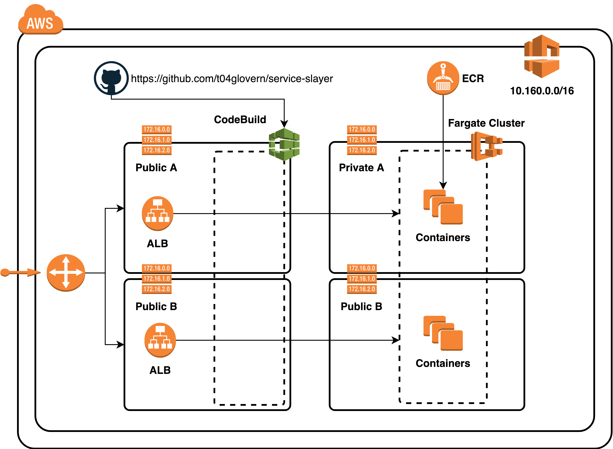

# Service Slayer

## Architecture



## Deploy Test Containers

```bash
aws cloudformation update-stack \
    --stack-name "service-slayer" \
    --template-body file://cloudformation/deployment.yaml \
    --parameters file://cloudformation/deployment-params.json \
    --capabilities CAPABILITY_IAM
```

### Resources

* **AWS::ECS::Cluster**:            service-slayer-cluster
* **AWS::ECS::Service**:            service-slayer-arbiter-api-service
* **AWS::ECS::Service**:            service-slayer-offense-api-service
* **AWS::ECS::Service**:            service-slayer-defense-api-service
* **AWS::ECS::TaskDefinition**:     service-slayer-arbiter-api-task
* **AWS::ECS::TaskDefinition**:     service-slayer-defense-api-task
* **AWS::ECS::TaskDefinition**:     service-slayer-offense-api-task

### Endpoints

#### Local

* **arbiter-api**: `http://localhost:2999`
* **defense-api**: `http://localhost:3000`
* **offense-api**: `http://localhost:3001`

##### Local Tasks

* **arbiter-api**: `http://localhost:2999/tasks`

#### ALB

* **arbiter-api**: `http://<service-slayer-arbiter-api-lb>` 
* **defense-api**: `http://<service-slayer-defense-api-lb>` 
* **offense-api**: `http://<service-slayer-offense-api-lb>` 

##### ALB Tasks

* **arbiter-api**: `http://<service-slayer-arbiter-api-lb>/tasks`
